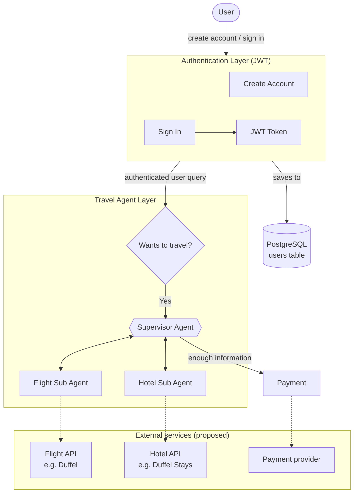
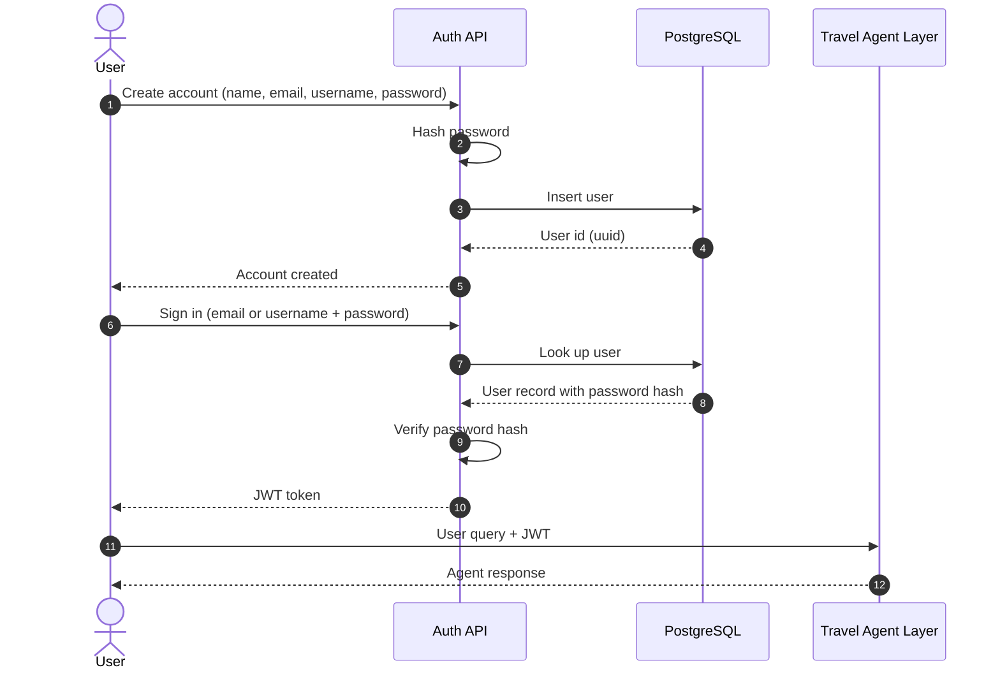
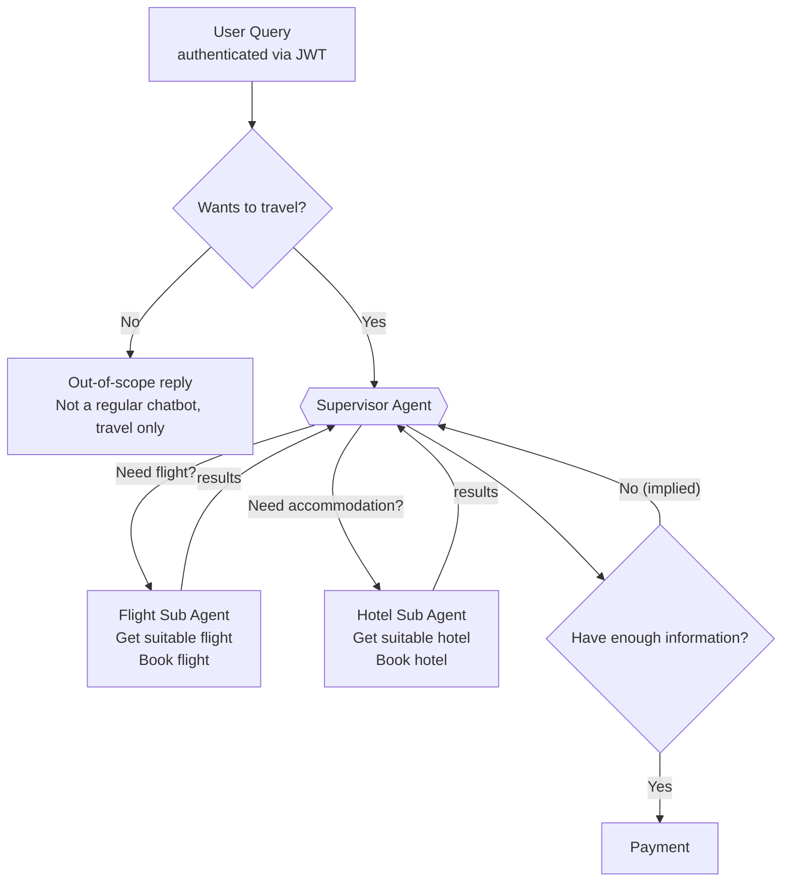
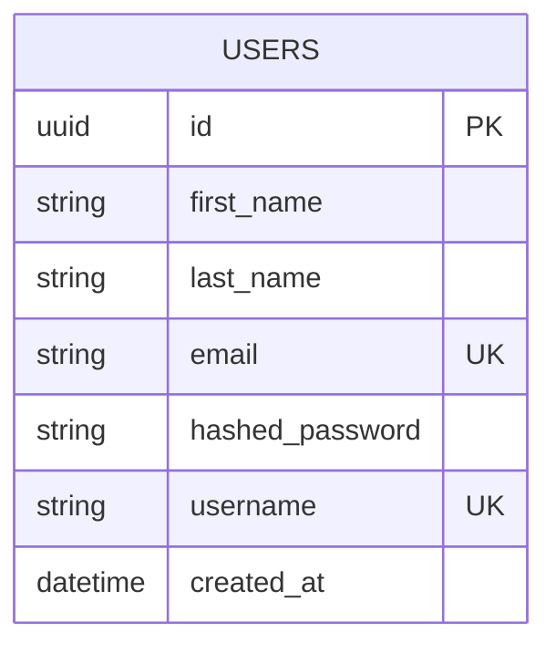

# AI Travel Agent: System Design

A **travel-only** conversational agent. Users sign in, describe a trip in natural language, and a **supervisor agent** delegates to specialised **flight** and **hotel** sub-agents. When enough information has been gathered, the user is taken to **payment**.

> It is deliberately *not* a general-purpose chatbot: non-travel queries are turned away.

---

## 1. High-level architecture

| Layer | Responsibility |
|---|---|
| **Authentication** | Account creation, sign-in, and issuing a JWT that authorises every later request |
| **PostgreSQL** | Persistent storage of user accounts |
| **Travel Agent** | Scope check, orchestration, flight search and booking, hotel search and booking |
| **Payment** | Takes over once the supervisor has all the information it needs |
| **External services** | Third-party providers behind the sub-agents and payment (proposed, not in the original sketch) |

---

## 2. Authentication flow

---

## 3. Agent orchestration flow

**How it works**

1. **Scope check.** Every authenticated query is first classified as travel-related or not. Non-travel queries get a polite refusal.
2. **Supervisor.** Decides what the trip needs and routes work to the right sub-agent.
3. **Flight Sub Agent.** Finds suitable flights and books the chosen one.
4. **Hotel Sub Agent.** Finds suitable accommodation and books the chosen one.
5. **Loop.** Sub-agents report back to the supervisor, which keeps going until it has enough information.
6. **Payment.** Once the supervisor is satisfied, the flow hands off to payment.

---

## 4. Data model

| Field | Type | Notes |
|---|---|---|
| `id` | uuid | Primary key |
| `first_name`, `last_name` | string | |
| `email` | string | Identifier and sign-in credential |
| `hashed_password` | string | Never store the plain password |
| `username` | string | Alternative sign-in credential |
| `created_at` | datetime | |

Sign-in accepts **either** the username or the email, so both need to be unique.

---

## 5. Proposed tech stack

The original sketch does not name technologies. This is a suggested fit:

| Concern | Suggestion |
|---|---|
| API and auth | FastAPI, JWT (e.g. `python-jose` or `PyJWT`), `passlib`/`bcrypt` for hashing |
| Database | PostgreSQL with SQLAlchemy and Alembic migrations |
| Agent orchestration | LangGraph (supervisor plus sub-agent graph), LangSmith for tracing |
| Flights | Duffel API (search, offers, orders) |
| Hotels | Duffel Stays or another accommodation API |
| Payment | Duffel Payments, Stripe, or another provider |
| Deployment | Docker, AWS (EC2 and RDS) or GCP |

---

## 6. Open questions

Things the sketch leaves undecided:

- **`verified` field.** The sign-up form lists a *verified* flag, but the users table does not include it. Decide whether email verification is required, and add the column if so.
- **JWT details.** Access-token lifetime, refresh tokens and logout or revocation.
- **Out-of-scope behaviour.** The exact reply for non-travel queries, and how borderline queries are classified.
- **Supervisor loop.** What counts as "enough information" (dates, origin, destination, passengers, budget) and how many clarifying questions to allow.
- **Booking safety.** Booking and payment are irreversible, so add an explicit user confirmation step before any booking call.
- **State.** Where the conversation and trip state live between turns (for example a LangGraph checkpointer in PostgreSQL).
- **Payment.** Which provider, and what happens on failure or timeout.
